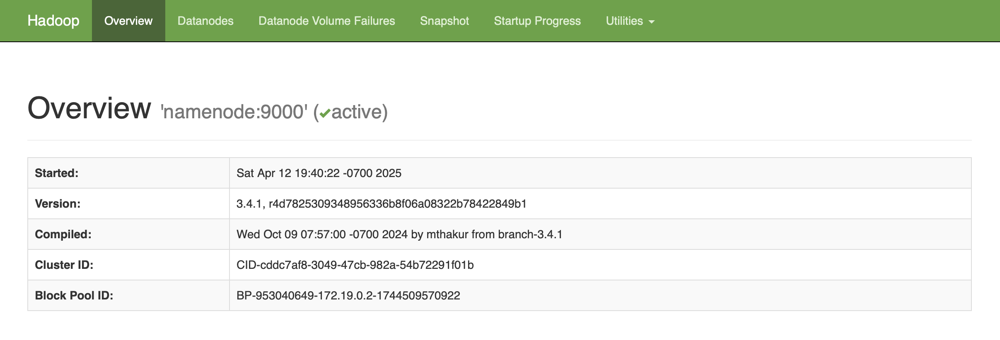
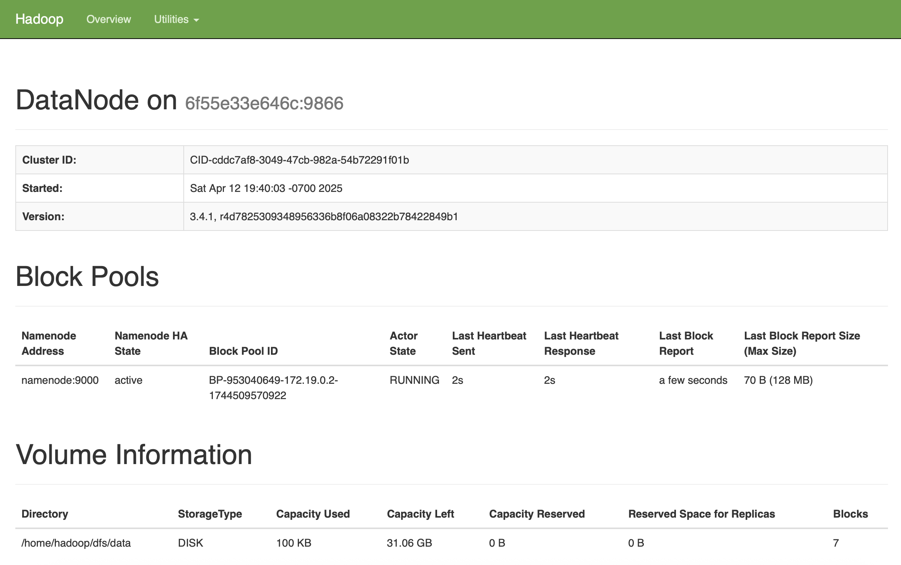
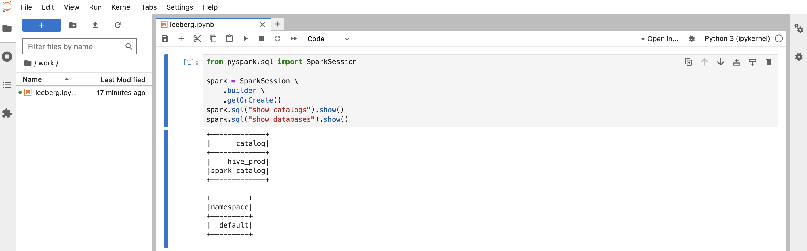

# Big Data Playground
Local playground for Spark and Jupyter notebooks, plus Iceberg support

## Motivation

Learning more about data analytics tooling, especially Spark and interactive
notebooks such as Jupyter.

## How am I testing this

This was created on:
- Hardware
  - MacBook Pro (Nov 2023) - Apple M3 Max (Apple Silicon), 36 GB
  - macOS Sequoia 15.4
- Software
  - IntelliJ IDEA 2024.3.5
  - Homebrew 4.4.29
  - Docker version 28.0.4, build b8034c0ed7
  - colima version 0.8.1
  
## Pre-requisites

This project has the following pre-requisites:
- Homebrew
- Colima
- Docker (cli and compose tools, **not Docker Desktop**)
- Parquet-cli (optional)

### Installing Homebrew

Brew is a fast, easy to use package manager for macOS.

Installing is simple, just navigate to [Homebrew homepage](https://brew.sh) and follow the instructions.
Once installed, try 
```shell
brew doctor
```
If the output is `Your system is ready to brew.` then you're all set with this step.

### Installing Colima

Colima is a container runtime for macOS that requires minimal configuration  and it' compatible with Apple Silicon and Rosetta.

To install, we will rely on brew 

```shell
brew install colima
```

Once installed, you can choose to start Colima as a system service. **This is optional**.
```shell
brew services start colima
```

#### Recommended resource configuration for this project
Colima comes out of the box with the following resource allocation
- CPU: 2 cores
- Memory: 2g
- Disk: 100g

Since we will be running multiple containers that use a lot of memory, my recommended settings are
- CPU: 4 cores
- Memory: 6g
- Disk: 100g

To change the current Colima configs, simply start colima on edit mode
```shell
colima start --edit
```

This will open Colima config file on a text editor.
Change the values for `cpu` and `memory` accordingly, then exit the editor (if you are not VIM savvy, press ESC a cuple of times, then enter `:wq` making sure to include the colon at the beginning).
Once closed, colima will ask to reload the config

```shell
colima start --edit
INFO[0000] editing in vim
colima is currently running, restart to apply changes? [y/N]
```

Type `y`, press **Enter** and you're all set.

### Installing Docker tools

We can install the Docker cli, which in turn will use colima as the container runtime.
This will allow you to use Docker commands to interact with colima for a better experience.

Once again, we will rely on brew

```shell
brew install docker-compose docker-credential-helper docker-buildx
```

Once all is installed, make sure Docker can talk to colima

```shell
docker context list
```
```shell
NAME       DESCRIPTION                               DOCKER ENDPOINT                                      ERROR
colima *   colima                                    unix:///Users/cristian/.colima/default/docker.sock
default    Current DOCKER_HOST based configuration   unix:///var/run/docker.sock
```

Make sure colima is on the list and is marked as current (with a `*`). If it is not active, try using 
```shell
docker context use colima
```

### Installing parquet-cli

This is an optional dependency, just in case you want to play around with parquet files (the default file format for Iceberg tables) 
Brew to the rescue!

```shell
brew install parquet-cli
```

## Building the images

Just use the Makefile on the project root level.

For example, to build the Hive Metastore image, run
```shell
make build-metastore
```

To build all images
```shell
make build-all
```

There are additional targets to tag and publish images, but make sure
to update `DOCKER_USERNAME` on the Makefile and also do a `docker login`
for all DockerHub commands to succeed.

## Spinning up the environment

For interactive mode, simply run 
```shell
docker compose up
```

Or for detached mode
```shell
docker compose up -d
```

To stop the stack
```shell
docker compose down
```

To track the status of the stack
```shell
docker stats
```

To check the output of a given container
```shell
docker compose logs <container-name>
```

## Relevant bookmarks

Services that can be accessed once the stack is active

- Hadoop NameNode: 
  - http://localhost:9870/
    

    
- Hadoop DataNode: 
  - http://localhost:9864/
    


- Jupyter Notebooks 
  - http://localhost:8888/
    

> [!IMPORTANT]  
> Jupyter notebooks endpoint is secured using a random token that it's generated upon container startup.
> To find the current token, simply look into the container logs for the lik.
> ```shell
> docker compose logs jupyter-notebook
> ```
> Then look for the link on the output, like the following example:
> ```shell
> jupyter-notebook  |     To access the server, open this file in a browser:
> jupyter-notebook  |         file:///home/jovyan/.local/share/jupyter/runtime/jpserver-8-open.html
> jupyter-notebook  |     Or copy and paste one of these URLs:
> jupyter-notebook  |         http://4739239bb49c:8888/lab?token=some-random-token
> jupyter-notebook  |         http://127.0.0.1:8888/lab?token=some-random-token
> ```
> 

- Hive Metastore (via BeeLine)
  - `beeline -u jdbc:hive2://localhost:10000`

## Next steps

- Tag images properly
- Sample data preloaded on HDFS.
